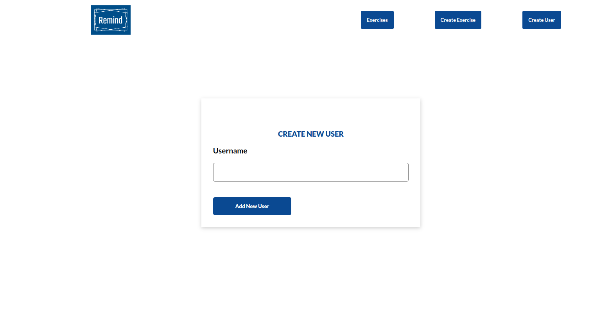
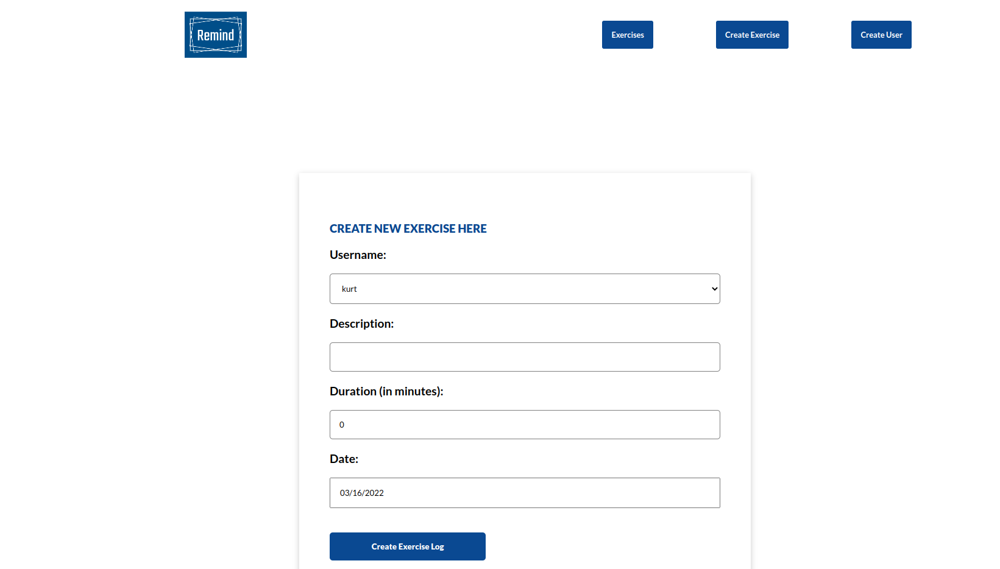

**Site URL**:

## Technologies used:

**MERN Stack**

### How to run the project.

-Open your terminal in Linux or CMD in Windows and run: _git clone git@github.com:Trend20/excercise-tracker.git_

-Then Open the cloned project folder in your favorite code editor.

-Open the terminal and run: _npm install_ on the root directory.

-Open another terminal tab and _cd_ into the #backend directory and run: _npm install_ to install all the project dependencies.And the
after all the dependencies are already installed, run _npm start_ to start the backend server in the locally.

-After all the frontend dependencies are already installed, run _npm start_ to start the react application in the localhost
where it will navigate to your browser and show the application.
